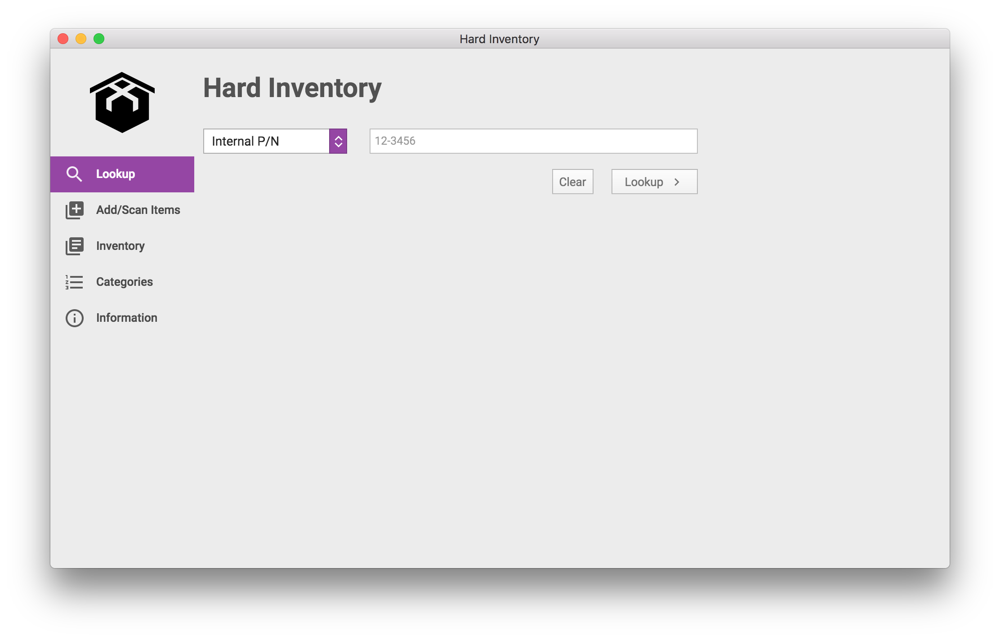
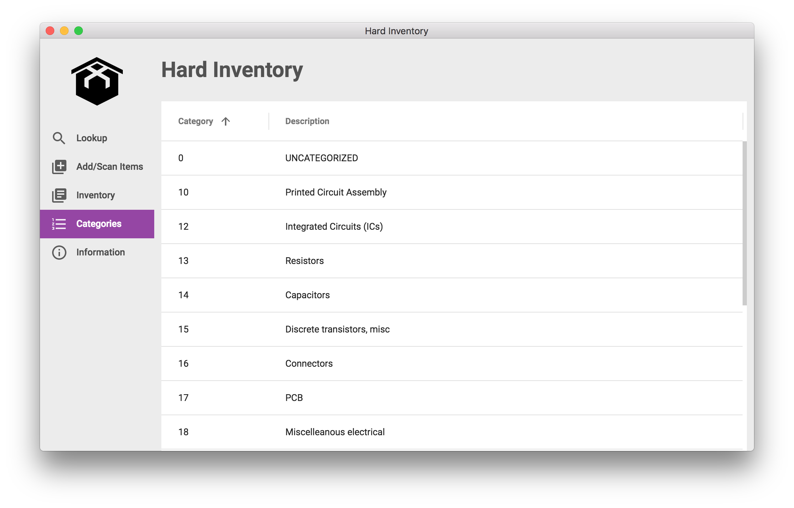

# Hard Inventory


Simplified and fast inventory management for hardware startups, small businesses, and hobbyists getting burried alive by their electronic components (and other things that need to be accounted for).

* Use a barcode scanner to quickly and accurately scan 1D and 2D barcodes from Digi-Key, Mouser, Arrow, etc into a Google Sheets document.
* Manual entry for any type of inventory, not just electronic components (track shots back from the injection molder, boxes for shipping, pens...).
* Electronic component information is automatically populated from Octopart, including the component type for auto-generating (internal) part numbers with.
* Print out barcodes (QR codes) and human-readable text labels for organization.

The design intent is to be a low-overhead system that gets all your inventory entered fast and accurately, so later if and when you need to move to a more complex and capable system, it's easy to make the transition. To this end, the application is backed by Google Sheets, not a database - this way you can easily manually edit data, copy/paste to Excel, etc, etc. This design certainly has its limitations, but also some pretty huge advantages.

## Lookup screen



### Lookup by Location


### Lookup by Part Number


## Add/Scan screen


### Auto-populating fields


## Inventory table (editable, filterable, and sortable)


## Categories table (editable, filterable, and sortable)



# Quick start

Make sure you have [Node.js](https://nodejs.org) installed, then type the following commands...
```sh
git clone https://github.com/ProxxiTech/HardInventory.git
<set configuration options here; see Configuration below>
cd HardInventory
npm install
npm start
```
...and if everything went well, you will have Hard Inventory on your screen.

To build a distribution (installer) package for the current operating system only...
```sh
npm run release
```

To build distribution (installer) packages for all platforms (macOS/Windows/Linux)...
```sh
npm run release-all
```
Only macOS can build macOS (as well as Windows and Linux) builds, while the other platforms can build eachother but not macOS. This is unfortunately due to macOS codesigning only working on macOS systems.

# Configuration

## Spreadsheet

You will need to create a Google Sheet spreadsheet for storing inventory and category data in, and this needs to be in a specific format. You can use this spreadsheet template to create your own spreadsheet from; simply open it and then select File | Make a copy... to create a duplicate in your Google account.
https://docs.google.com/spreadsheets/d/16HUKhmg7VBt5Z-bzD3HMQdtWii8MMSHKtTy1gjixDSg/edit?usp=sharing

You will want to add some additional categories to the Categories sheet (the tab at the bottom) of the spreadsheet; there are a few basic categories already such as capacitors and resistors (don't change these!), but you'll likely want some more such as PCBs, molded parts, office supplies, etc. It's best to keep to 2-digit category names (must be numbers only) for formatting's sake. Additional categories can be added at any point, either from within Hard Inventory or in the spreadsheet directly.

## Application

There are two .json files currently required for configuring Hard Inventory - app/config.json, and app/Inventory-System-Auth.json. Neither of these files are in the git repository, and must rather be created manually (well, Inventory-System-Auth.json is exported from Google, but more on that later).

Firstly, config.json
```json
{
  "spreadsheet_id": "<id-from-your-spreadsheet-url>",
  "spreadsheet_url": "https://docs.google.com/spreadsheets/d/<spreadsheet_id>/edit?usp=sharing",
  "octopart_key": "<your Octopart API key>"
}
```
The spreadsheet_url you get from the Share window in Google Sheets. The spreadsheet_id is just the long ID part of that same URL (in the example template linked above, that would be16HUKhmg7VBt5Z-bzD3HMQdtWii8MMSHKtTy1gjixDSg - but make sure to use the id from your own spreadsheet, not the template). The octopart_key is an API key provided to you when you sign up at https://octopart.com/api/home, and lets Hard Inventory programmatically search for component details.

Next up we have Inventory-System-Auth.json, which is obtained from Google. Unfortunately it's a multi-step process, and the instructions at the link are outdated (things have been renamed) so you'll have to do a bit of thinking to find the correct steps to take - but it will set you on the right track at least.
https://github.com/theoephraim/node-google-spreadsheet#service-account-recommended-method

Once you've completed those steps, you will be provided a json file to download; save it as app/Inventory-System-Auth.json.

# TODO

* Add support for more label printers. Only the Brother QL-800 with 29mm labels is supported right now, but other QL-series label printers that support 29mm labels should easily be possible. The only restriction from supporting other printers is my lack of hardware to test on.
* Results from the Lookup screen should be editable
* Auto-create the required default categories (resistors, capacitors, etc) if they don't exist
* Allow configuration of Octopart API key, and Google spreadsheet/keys/auth at runtime, so pre-built binaries can be distributed. Currently the configuration .json files are compiled in and thus can't be changed.
* Simplify configuration of spreadsheet and Google auth somehow? I'm not sure anything can be done, but it's definitely annoyingly complex right now.
   * Can the Google sheets API create new spreadsheets, or clone existing ones? Would remove a few setup steps.

# Structure of the project

The application consists of two main folders...

`src` - files within this folder get transpiled or compiled (because Electron can't use them directly).

`app` - contains all static assets which don't need any pre-processing. Put here images, CSSes, HTMLs, etc.

The build process compiles the content of the `src` folder and puts it into the `app` folder, so after the build has finished, your `app` folder contains the full, runnable application.

Treat `src` and `app` folders like two halves of one bigger thing.

The drawback of this design is that `app` folder contains some files which should be git-ignored and some which shouldn't (see `.gitignore` file). But this two-folders split makes development builds much, much faster.

# Development

## Starting the app

```sh
npm start
```

## The build pipeline

Build process uses [Webpack](https://webpack.js.org/). The entry-points are `src/background.js` and `src/app.js`. Webpack will follow all `import` statements starting from those files and compile code of the whole dependency tree into one `.js` file for each entry point.

[Babel](http://babeljs.io/) is also utilised, but mainly for its great error messages. Electron under the hood runs latest Chromium, hence most of the new JavaScript features are already natively supported.

## Environments

Environmental variables are done in a bit different way (not via `process.env`). Env files are plain JSONs in `config` directory, and build process dynamically links one of them as an `env` module. You can import it wherever in code you need access to the environment.
```js
import env from "env";
console.log(env.name);
```

## Upgrading Electron version

To do so edit `package.json`:
```json
"devDependencies": {
  "electron": "1.7.9"
}
```
*Side note:* [Electron authors recommend](http://electron.atom.io/docs/tutorial/electron-versioning/) to use fixed version here. As of Electron 2 this will change to correct semver versioning, but for now we're stuck with fixed versions.

## Adding npm modules

Remember to respect the split between `dependencies` and `devDependencies` in `package.json` file. The distributable will contain modules listed in `dependencies` after running the release script.

*Side note:* If the module you want to use is a native one (not pure JavaScript but compiled binary) you should first  run `npm install name_of_npm_module` and then `npm run postinstall` to rebuild the module for Electron. You need to do this once after you're first time installing the module. Later on, the postinstall script will fire automatically with every `npm install`.

# Testing

Run all tests:
```sh
npm test
```

## Unit

```sh
npm run unit
```
Using [electron-mocha](https://github.com/jprichardson/electron-mocha) test runner with the [Chai](http://chaijs.com/api/assert/) assertion library. You can put your spec files wherever you want within the `src` directory, just name them with the `.spec.js` extension.

## End to end

```sh
npm run e2e
```
Using [Mocha](https://mochajs.org/) and [Spectron](http://electron.atom.io/spectron/). This task will run all files in `e2e` directory with `.e2e.js` extension.

# Making a release

To package your app into an installer use command:
```sh
npm run release
```
or
```sh
npm run release-all
```

Once the packaging process finished, the `dist` directory will contain your distributable file.

We use [electron-builder](https://github.com/electron-userland/electron-builder) to handle the packaging process. It has a lot of [customization options](https://www.electron.build/configuration/configuration), which you can declare under `"build"` key in `package.json`.

You can package your app cross-platform from a single operating system, [electron-builder kind of supports this](https://www.electron.build/multi-platform-build), but there are limitations and asterisks (only macOS can build for macOS for instance).
